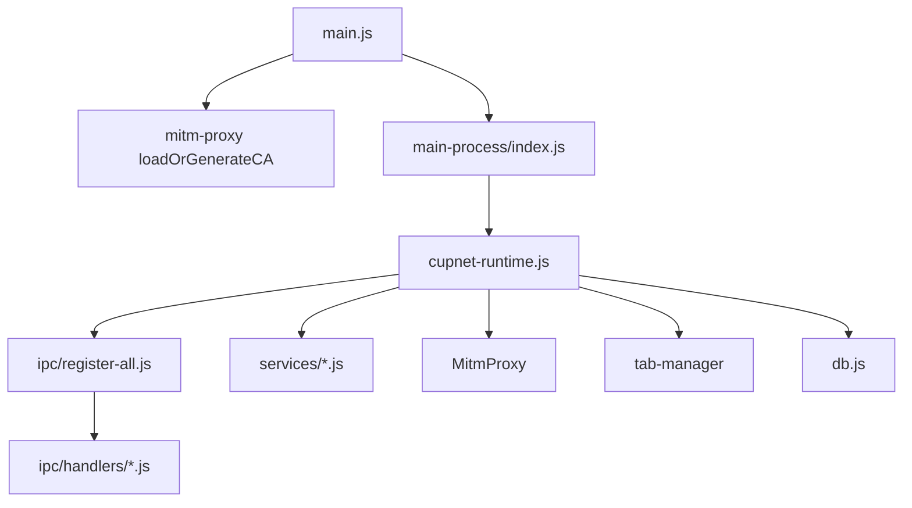

# CupNet — полный отчёт по продукту и технике

Сформирован по плану анализа (архитектура, качество кода, безопасность, производительность, тесты/CI, UX, продукт).  
**Точка входа:** `main.js` → `main-process/index.js` → `main-process/cupnet-runtime.js` (не `electron-app/app.js`).

**Язык интерфейса приложения:** весь пользовательский текст в CupNet (заголовки окон, подписи, кнопки, подсказки, диалоги, ошибки, плейсхолдеры) — **на английском**.

---

## 1. Архитектура

### Текущая загрузка

### Факты

| Пункт | Детали |
|-------|--------|
| Активный runtime | `main-process/cupnet-runtime.js` (~1210 строк) — композиция и связывание |
| Регистрация IPC | `registerMainProcessIpc` в `main-process/ipc/register-main-ipc.js` — в `cupnet-runtime.js` **нет** `ipcMain.handle` |
| Модули handlers | 21 файл в `main-process/ipc/handlers/` (всего ~176 строк с `ipcMain.handle` / `ctx.ipcMain.handle`) |
| Устаревший дубликат | `electron-app/app.js` (~5950 строк, **154** `ipcMain.handle`) — **нигде** не подключается через `require()` в репозитории (только комментарии); после сверки с актуальным кодом — кандидат на удаление |
| Паттерн Strangler | Описан в `main-process/services/README.md`: сервисы и IPC-handlers вынесены из монолита |

### Риск дублирования IPC

- В продакшене IPC регистрируется **только** через `register-all.js` + handlers.
- В `electron-app/app.js` по-прежнему большая параллельная поверхность `ipcMain.handle`. Если когда-нибудь загрузить оба — конфликт каналов; **проверьте**, что tooling не импортирует `electron-app/app.js`.

### Безопасные шаги выноса (6 месяцев)

1. **Удалить или архивировать** `electron-app/app.js` после diff с `cupnet-runtime.js` + handlers (или односторонняя синхронизация), чтобы убрать путаницу.
2. **Дальше упростить `cupnet-runtime.js`**: оставшийся glue `onRequestLogged` / stability перенести в `main-process/services/mitm-log-pipeline.js` (или аналог).
3. **Сохранить разбиение handlers по доменам** (proxy, tabs, cookies-dns, trace-har, page-analyzer, …) — уже соответствует плану.

### Риск циклических зависимостей

- Активное использование `ctx` / `ipcScopeGet` в handlers — допустимо, если задокументировано в `main-process/ipc/README.md` (если есть). Предпочтительнее **фабрики через DI**, чем `require` к `cupnet-runtime` из handlers.

---

## 2. Качество кода и технический долг

| Категория | Находка | Серьёзность |
|-----------|---------|-------------|
| Пустой / минимальный `catch` | Примеры: `electron-app/app.js:4340`, `tab-manager.js:806`, `cookies-dns-ipc.js` (защитные закрытия), `page-analyzer-ipc.js:325`, string templates в `rules.js` с `catch (e) {}` для инжектов | Средняя — пересмотреть горячие пути |
| Монолитный файл | `electron-app/app.js` 5950 строк, если его ещё поддерживают | Высокая |
| Хардкод `ipinfo.io` | `main-process/services/proxy-service.js`, `misc-ipc.js`, устаревший `electron-app/app.js` | Низкая — вынести URL + fallback |
| `eval` / `Function` | `request-interceptor.js`: `vm.runInNewContext` для валидации intercept — **по задумке**; в тестах — `new Function` | Задокументировать модель доверия к правилам пользователя |
| TODO/FIXME | **0** совпадений `\bTODO\b` в JS — маркеров бэклога в коде нет | — |

**Рекомендация:** правило линтера или pre-commit grep на пустой `catch {}` в `main-process/` (при необходимости исключить строки в `rules.js`).

---

## 3. Безопасность

| Проверка | Результат |
|----------|-----------|
| `contextIsolation: true`, `nodeIntegration: false` | Встречается в `main-process/services/sub-windows.js`, `tab-manager.js`, `proxy-service.js` (скрытое окно), `cookies-dns-ipc.js` (окно DevTools) |
| Preload вкладок | `preload-view.js` — **минимальный** `electronAPI` по сравнению с полным `preload.js` (хорошо) |
| CSP | Есть у многих HTML-оболочек (`browser.html`, `proxy-manager.html`, `settings.html`, …); часть — `'unsafe-inline'` для стилей, типично для локального UI Electron |
| Секреты | Шаблоны прокси шифруются через `safeStorage`, когда доступно (`proxy-ipc.js`); в отображаемых строках пароли маскируются |
| XSS | Рендереры активно используют `innerHTML` — частично смягчено через `esc()` / структуры; **аудит** путей, где URL/тело правила склеиваются без экранирования |
| Динамический код | `request-interceptor.js` использует `vm` для скриптов intercept — в песочнице; убедиться, что пользовательский контент не выходит из sandbox (объект `sandbox`) |

**Итог по серьёзности:** критичных находок при статическом обзоре нет; главный остаточный риск — **HTML-инъекция** в UI логов/сравнения, если недоверенные данные рендерятся без экранирования.

---

## 4. Производительность и память

| Область | Находка |
|---------|---------|
| Батчинг IPC | `main-process/services/ipc-batch-messenger.js` — лог батч **50 мс**, макс. **200** записей; intercept/DNS батчи **80 мс** — снижает флуд |
| Дедуп | `cupnet-runtime` / MITM: `_seenRequestIds` Set с обрезкой при 5000; `_lastMitmLogKey` Map с вытеснением по времени |
| Индексы SQLite | `db.js`: индексы по `requests(session_id, tab_id, url, status, created_at, duration_ms)`, notes, ws_events — разумно для фильтров |
| Синхронный I/O | Ранний `readFileSync` настроек в `cupnet-runtime.js` (bypass list) — маленький файл, на старте приемлемо |
| Большие тела | Лог пишет тела в БД — зависят от политики хранения; проверить лимиты в `db.js` / настройках |

**Быстрые выигрыши:** (1) задокументировать макс. размер тела на строку. (2) Периодический VACUUM или prune старых сессий, если ещё нет. (3) Профилировать число вкладок (`WebContentsView`) и память на длинных сессиях.

---

## 5. Тесты и CI

| Pipeline | Триггер | Тесты |
|----------|---------|-------|
| `build-all.yml` | Теги `v*`, `workflow_dispatch` | **Нет** `npm test` — только сборка |
| `reliability-nightly.yml` | Cron 02:00 UTC | `npm test` → `tests/run-all.sh` + `baseline:stability` |
| PR / `push` в `main` | — | **Нет** автоматического workflow тестов в просмотренных файлах |

**Юнит-тесты** (`tests/run-all.sh`): utils, UA, page-analyzer endpoints, reliability policy, proxy resilience, traffic-mode-router, safe-catch, secrets, mitm, dns-mitm (node --test), interceptor, rules-engine, mitm-integration, test-db (Electron как Node).

**E2E** (`npm run test:e2e`, Playwright): в просмотренных CI не подключены.

**Рекомендации**

1. Добавить `.github/workflows/pr-check.yml`: на `pull_request` — `npm ci`, `npm test`, опционально `npm run test:e2e` с `continue-on-error`, пока не стабилизируется.
2. Опционально: `npm test` на `push` в `main` (быстрая обратная связь).
3. `test-db.js` через Electron as Node — нормально; альтернатива — Jest/sqlite mock, если нужен CI без бинарника Electron.

**Матрица покрытия (высокий уровень)**

| Модуль | Юнит-тесты |
|--------|------------|
| `utils`, traffic-mode-router, mitm-proxy (частично), interceptor, rules-engine, db (условно) | Да |
| `cupnet-runtime.js`, `sub-windows.js`, большинство рендереров | Нет прямого |
| E2E | По сути smoke |

---

## 6. UX / UI (17 окон)

**Окна (корневые HTML):** browser, log-viewer, proxy-manager, rules, cookie-manager, request-editor, page-analyzer, console-viewer, new-tab, notes, settings, cupnet-guide, dns-manager, compare-viewer, ivac-scout, modal-logging.

**Сквозное**

- Общие стили в `styles.css` (~3200+ строк) — риск **несогласованности** между инструментами; имеет смысл design tokens / разбивка по поверхностям.
- **Доступность:** смешанное использование `aria-*`; горячие клавиши есть частично — желательен формальный проход (фокус в модалках, таблица лога).

**Топ-10 UX-улучшений (по impact, с действиями)**

1. **Единая «command palette»** (Cmd-K) в браузере + log viewer — поиск вкладок, открытие инструментов, навигация по URL (паттерн: VS Code / Linear).
2. **Единый chrome окон** — одинаковая высота title bar, паттерны назад/закрыть для окон из `sub-windows.js`.
3. **Онбординг при первом запуске** — 3 шага: доверие к CA → режим трафика → тестовый сайт (сократить time-to-first-capture).
4. **Сетевой лог:** колонки по умолчанию + сохранённые наборы колонок; сохранять FTS-запрос в сессии.
5. **Proxy Manager:** список профилей уже укорочен — добавить inline «last error» при ошибке подключения.
6. **Settings:** сгруппировать MITM / privacy / appearance со sticky subnav.
7. **Тосты ошибок:** централизованный `showError` с копированием debug-info (версия сборки из `get-app-version`).
8. **Клавиатура:** задокументировать шорткаты в `cupnet-guide.html` + cheat sheet overlay.
9. **Состояния загрузки:** skeleton-строки в log viewer при тяжёлом импорте.

*Референсы:* панель Network в Chrome DevTools, Proxyman (список + фильтр), Linear (command palette).

---

## 7. Продукт и конкуренты

### Позиционирование (одно предложение)

**CupNet — отдельный браузер на Chromium со встроенным MITM, управлением TLS fingerprint и изоляцией сессий — для разработчикам, которым нужен трафик «как по проводу» и чувствительные к антиботу страницы в одном инструменте.**

### Отличия от «обычных» HTTP-прокси

| Сильная сторона | Комментарий |
|-----------------|-------------|
| **TLS fingerprinting (AzureTLS)** | Редко в классических HTTP-дебаггерах; выравнивает wire с профилями Chrome/Firefox/Safari |
| **Полный браузер + MITM** | Обходит подводные камни `protocol.handle` для Cloudflare (по правилам проекта) |
| **Изоляция по вкладкам** | Cookies/сессии как у нескольких профилей без отдельных пользователей ОС |
| **Шаблоны прокси** | `{VAR}`, цепочки — под rotating residential/datacenter сценарии |

### Пробелы vs Proxyman / Charles / HTTP Toolkit / mitmproxy / Burp

| Пробел | У конкурентов |
|--------|----------------|
| Экосистема / плагины | Burp Extender, addons mitmproxy |
| Полировка breakpoint UX | Charles / Proxyman map local/remote |
| Захват с мобильного | Proxyman iOS one-click — CupNet ориентирован на десктопный браузер |
| Командная работа | Облачный шаринг в коммерческих инструментах |
| Бесплатный сегмент | mitmproxy / HTTP Toolkit OSS |

### Три персоны

1. **Web QA / SDET** — воспроизводимые сессии, HAR, compare, правила.
2. **Инженер по антиботу / интеграциям** — TLS + прокси + реальный Chromium, Turnstile-чувствительные сценарии.
3. **Продвинутый пользователь с privacy** — DNS overrides, изоляция cookie, MITM-логи.

### Roadmap (топ-10 тем в стиле RICE)

| # | Тема | Обоснование |
|---|------|-------------|
| 1 | CI: PR + `npm test` | Высокая уверенность, средние усилия |
| 2 | Удалить/слить `electron-app/app.js` | Меньше класса багов и путаницы у разработчиков |
| 3 | E2E на PR (smoke) | Ловит регрессии открытия окон / IPC |
| 4 | Command palette | Сильный UX-эффект для power users |
| 5 | Экспорт/шаринг сессии (HAR + сокрытие секретов) | Коллаборация |
| 6 | Структурированный лог в main (вместо разрозненного `console`) | Операции / поддержка |
| 7 | Mobile или внешний браузер (doc-only MVP) | История для паритета с конкурентами |
| 8 | Plugin hook (скрипты MITM-трансформаций) | Power users |
| 9 | Производительность: лимиты тел + prune БД | Масштаб |
| 10 | Доступность: проход по логу + настройкам | Инклюзия + клавиатура |

---

## Приложение: примерный объём команд

- API в `preload.js`: **~230** имён (объект contextBridge).
- Строки с `ipcMain.handle`: ~154 в `electron-app/app.js` (наследие) + ~176 в `main-process/ipc/handlers/` — **в продакшене используются только handlers**.

---

*Снимок статический; после крупных рефакторингов имеет смысл повторить анализ.*
